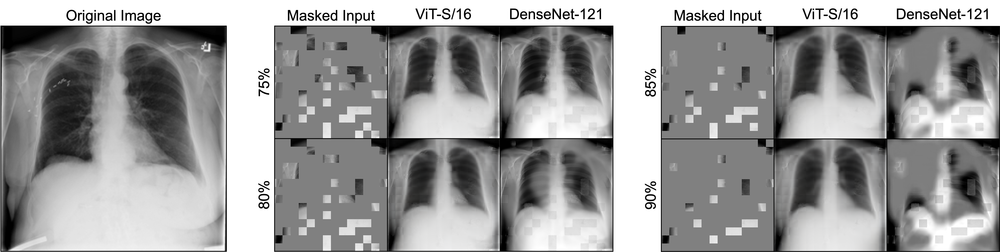

# Medical Masked Autoencoders

## Paper

This repository provides the official implementation of training Vision Transformers (ViT) for (2D) medical imaging tasks as well as the usage of the pre-trained ViTs in the following paper:

<b>Delving into Masked Autoencoders for Multi-Label Thorax Disease Classification</b> <br/>
[Junfei Xiao](https://lambert-x.github.io/), [Yutong Bai](https://scholar.google.com/citations?user=N1-l4GsAAAAJ&hl=en), [Alan Yuille](https://scholar.google.com/citations?user=FJ-huxgAAAAJ&hl=en&oi=ao), [Zongwei Zhou](https://www.zongweiz.com/) <br/>
Johns Hopkins University <br/>
IEEE/CVF Winter Conference on Applications of Computer Vision (WACV), 2023 <br/>
[paper](https://arxiv.org/abs/2210.12843) | [code](https://github.com/lambert-x/medical_mae)

## TO DO

- [x] Instructions for preparing datasets.
- [x] Instructions for pretraining and fine-tuning.

## Image reconstruction demo

<p align="center"></p>


## Installing Requirements

Our codebase follows the [MAE Official](https://github.com/facebookresearch/mae) and uses some additional packages.
You may use **one of** the following commands to build environments with `Conda` and `Pip`.

Conda:
```
conda create -n medical_mae -f medical_mae.yml 
```

Pip:
```
conda create -n medical_mae python=3.8
conda activate medical_mae
pip install -r requirements.txt 
```


## Preparing Datasets:

The MIMIC-CXR, CheXpert, and ChestX-ray14 datasets are public available on their official sites. You can download or request the access to them under the agreements.

You may also download them through the following links for research only and follow the official agreements.

MIMIC-CXR (JPG): https://physionet.org/content/mimic-cxr-jpg/2.0.0/

CheXpert (v1.0-small): https://www.kaggle.com/datasets/ashery/chexpert

ChestX-ray14 : https://www.kaggle.com/datasets/nih-chest-xrays/data


## Pre-training on ImageNet or Chest X-rays

The pre-training instruction is in [PRETRAIN.md](https://github.com/lambert-x/medical_mae/blob/main/PRETRAIN.md).

## Fine-tuning with pre-trained checkpoints

The fine-tuning instruction is in [FINETUNE.md](https://github.com/lambert-x/medical_mae/blob/main/FINETUNE.md).

The following table provides the pre-trained checkpoints used in Table 1:

You can download **all the weights** in the following table with this [link](https://drive.google.com/drive/u/0/folders/14bAPhAhrvYTfm41V4-IiLRe3l6Vxhb1q) (google drive).

| Model        | Pretrained Dataset | Method         | Pretrained                                                                                            | Finetuned (NIH Chest X-ray) | mAUC |
|:------------:|:------------------:|:--------------:|:-----------------------------------------------------------------------------------------------------:|:---------------------------------------------------------------------------:| :--------------:|
| DenseNet-121 | ImageNet           | Categorization | [torchvision official](https://download.pytorch.org/models/densenet121-a639ec97.pth)                  | [google drive](https://drive.google.com/file/d/16sPPYXsLoCp00_t3PDYOsm7_yewAV8oN/view?usp=share_link) | 82.2 |
| ResNet-50    | ImageNet           | MoCo v2        | [google drive](https://drive.google.com/file/d/1GVSc3TOEhItliMToyY8Z4oHW_Kxf8cRj/view?usp=share_link) | [google drive](https://drive.google.com/file/d/18XCBzJW5x0foEjWcQhpzVPpv_YEcdePk/view?usp=share_link) | 80.9 |
| ResNet-50    | ImageNet           | BYOL           | [google drive](https://drive.google.com/file/d/1AIJzhoXmbs5bjAqdmwXoy5R0peiyPU4L/view?usp=share_link) | [google drive](https://drive.google.com/file/d/1t13tMWCyYZzTkVa872oEqnYzXbrJpf4i/view?usp=share_link) | 81.0 |
| ResNet-50    | ImageNet           | SwAV           | [google drive](https://drive.google.com/file/d/1Puz15aWNM0t7B5RRq_ifc1dS4lnyFECG/view?usp=share_link) | [google drive](https://drive.google.com/file/d/1ahKNglVAJbh-AFWzG296hHkif2gwhErp/view?usp=sharing) | 81.5 |
| DenseNet-121 | X-rays (0.3M)      | MoCo v2        | [google drive](https://drive.google.com/file/d/1idLcwL4C0eSGoLc5PI4ZWHzNLq_mJY-g/view?usp=share_link) | [google drive](https://drive.google.com/file/d/1p4yKXYJG82FHpGRji2bK98xqeJ2J3sn5/view?usp=share_link) | 80.6 |
| DenseNet 121 | X-rays (0.3M)      | MAE            | [google drive](https://drive.google.com/file/d/1f5KePD48QmHua7C5HBUV3i0PqNPkgmqj/view?usp=share_link) | [google drive](https://drive.google.com/file/d/1bJC2ds2pw4bHpACMxEIU0PDgFioOJ1Vk/view?usp=share_link) | 81.2 |
| ViT-Small/16 | ImageNet           | Categorization | [DeiT Official](https://dl.fbaipublicfiles.com/deit/deit_small_patch16_224-cd65a155.pth)              | [google drive](https://drive.google.com/file/d/1pPor2eJkm6_x_Mui09XprEqHsInH8kXn/view?usp=share_link) | 79.6 |
| ViT-Small/16 | ImageNet           | MAE            | [google drive](https://drive.google.com/file/d/1QeAIWJWuNcccF09502xcnQ_2tbc2jRQG/view?usp=share_link) | [google drive](https://drive.google.com/file/d/1BNgcMGYgtr3VTtdewmaY6BfracIXKM9c/view?usp=share_link) | 78.6 |
| ViT-Small/16 | X-rays (0.3M)      | MAE            | [google drive](https://drive.google.com/file/d/1Yok1RemqP27iKJ5BUuoHhLRBB1GycITx/view?usp=share_link) | [google drive](https://drive.google.com/file/d/1DkZMkXcFpj_SdffYZzw-Dq5clfo_YqjZ/view?usp=share_link) | **82.3** |
| ViT-Base/16  | X-rays (0.5M)      | MAE            | [google drive](https://drive.google.com/file/d/10wqOFCkhyWp6JdSFADrH6Xu9e1am3gXJ/view?usp=share_link) | [google drive](https://drive.google.com/file/d/1eZXcoeMJAVjVJUNio2tCyHgiegaa-Vqr/view?usp=share_link) | **83.0** |


| Model        | Pretrained Dataset         | Finetuned (Chest X-ray) | mAUC | Finetuned (CheXpert) | mAUC | Finetuned (COVIDx) | Accuracy |
|:------------:|:------------------:|:---------------------------------------------------------------:|:----------------------------:| :--------------:| :--------------:| :--------------:| :--------------:|
| ViT-Small/16 | X-rays (0.3M)      | [google drive](https://drive.google.com/file/d/1DkZMkXcFpj_SdffYZzw-Dq5clfo_YqjZ/view?usp=share_link) | **82.3** | [google drive](https://drive.google.com/file/d/1QQ849TGv5H9RtFzNFIopn0Ef7yoNMRpn/view?usp=sharing) | **89.2** | [google drive](https://drive.google.com/file/d/1SexGCk0-dVjR4J0n53SFVbVBTj_ctEgZ/view?usp=drive_link) | **95.2** |
| ViT-Base/16  | X-rays (0.5M)      | [google drive](https://drive.google.com/file/d/1eZXcoeMJAVjVJUNio2tCyHgiegaa-Vqr/view?usp=share_link) | **83.0** | [google drive](https://drive.google.com/file/d/1yhU-648h5r8wvXGqehZykDoPiXDWHqpj/view?usp=sharing) | **89.3** | [google drive](https://drive.google.com/file/d/1N4aAJ1Xi_9tPUcFr4QDSwjyc9Uw7UTwO/view?usp=drive_link) | **95.3** |
## Citation

If you use this code or use our pre-trained weights for your research, please cite our papers:

```
@inproceedings{xiao2023delving,
  title={Delving into masked autoencoders for multi-label thorax disease classification},
  author={Xiao, Junfei and Bai, Yutong and Yuille, Alan and Zhou, Zongwei},
  booktitle={Proceedings of the IEEE/CVF Winter Conference on Applications of Computer Vision},
  pages={3588--3600},
  year={2023}
}
```

## License
This repo is under Apache 2.0 license.

## Acknowledgement

This work was supported by the Lustgarten Foundation for Pancreatic Cancer Research.

Our code is built upon [facebookresearch/mae](https://github.com/facebookresearch/mae).
